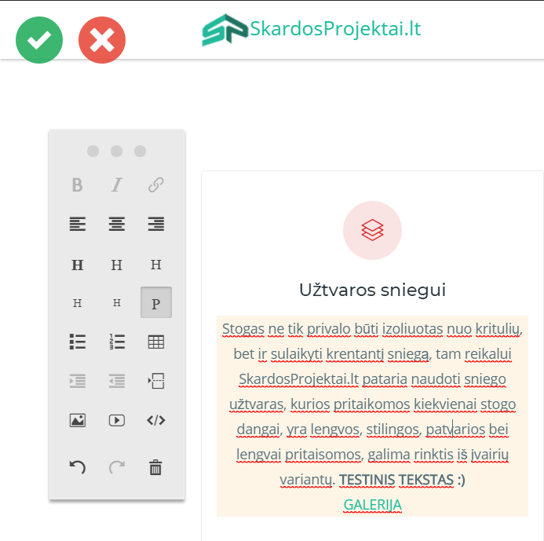

### SkardosProjektai.lt turinio valdymo dokumentacija
- Šioje dokumentacijoje pateikiamos instrukcijos kaip naudotis October CMS teikiamomis naujovėmis siekiant patogiai keisti SkardosProjektai.lt puslapio turinį.

### Įdiegtos naujovės
- Galimybė tiesiogiai keisti puslapio tekstinį turinį nesigilinant į kodą.
- Galimybė tvarkyti puslapyje atvaizduojamų galerijų turinį.

### Prisijungimas prie administratoriaus aplinkos
- Norint naudotis įdiegtomis naujovėmis būtina visų pirma prisijungti prie puslapio administratoriaus aplinkos. **Reikia atlikti tik porą žingsnių:**
1. Adresų juostoje prie svetainės adreso prirašyti ```/backend```.
2. Atsidariusiame lange suvesti prisijungimo duomenis.


### Tiesioginis tekstinio turinio keitimas
- Kadangi administratoriaus aplinka tiesiogiai nedalyvauja redaguojant puslapio tekstinį turinį, užtenka tik prie jos prisijungti norint iš sistemos gauti visus redagavimui reikiamus leidimus.

- Po prisijungimo prie administratoriaus aplinkos svetainės puslapiuose atsiras specialios ikonėlės. Spustelėjus šias ikonėles atidaroma turinio redagavimo aplinka.

- Pasirinkus norimą tekstą iki šiol tuščia įrankių juosta užsipildo įrankiais, kurių pagalba galima redaguoti pasirinktą teksto lauką.

- Baigus puslapio redagavimą tereikia nuspausti žalios varnelės ikonėlę, kad būtų įsaugoti visi atlikti pakeitimai.




### Galerijų turinio keitimas
- Galerijų turinio keitimo aplinka pasiekiama administratoriaus aplinkoje spustelėjus ant ```Media``` ikonėlės.

- Atsidariusiame puslapyje rodomos visos puslapio galerijos ir kiti paveiksliukai. Žemiau pateiktoje lentelėje vaizduojami galerijų pavadinimai ir paaiškinimai kas jose saugoma.

- Į atidarytą galeriją nuotraukos pridedamos paspaudus ```Upload``` mygtuką. Sąraše pasirinktą nuotrauką galima ištrinti spustelėjus šiukšliadėžės ikonėlę

| Aplankalo pavadinimas     | Kas saugoma                                          |
|---------------------------|------------------------------------------------------|
| main-gallery              | Pagridiniame puslapyje esančios galerijos nuotraukos |
| clients                   | Klientų galerijos nuotraukos                         |
| snow-guards               | Užtvarų sniegui nuotraukos                           |
| windowsills-from-tinplate | Skardinių palangių nuotraukos                        |
| rain-pipes                | Lietvamzdžių nuotraukos                              |
| chimneys                  | Kaminų nuotraukos                                    |
| decorations-from-tinplate | Apdailos iš skardos nuotraukos                       |
| decorations-for-hangars   | Apdailos angarams nuotraukos                         |
| fences-from-tinplate      | Tvorų iš skardos nuotraukos                          |
| metal-sheet-roofs         | Skardos stogų nuotraukos                             |


### Pastabos
- Į galeriją keliamos nuotraukos **PRIVALO** būti vienodo pločio ir ilgio (pikseliais). Keliant nevienodo dydžio nuotraukas išsikraipys galerijos.
- Keliamos nuotraukos dydžio limitas - 2 MB **(pakolkas)**
